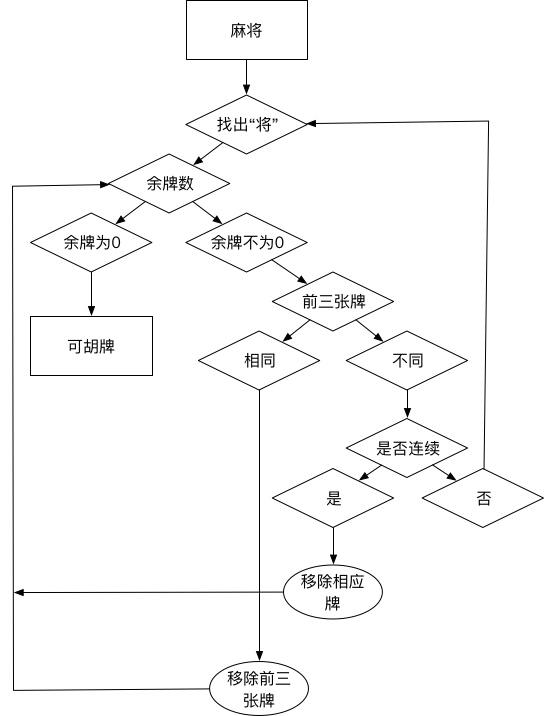

#### 思路

1. 首先找出所有包含一对的情形，移除对子（注意去重），记下剩余牌的所有集合为 Tn;
2. 针对每个 Tn 中的数组尝试移除一个顺子，成功转到 2，失败到 3。
3. 针对每个 Tn 中的数组尝试移除一个刻子（DDD），成功转到 2。
4. 若当前的数组的数量变为 0，则表示，当前的方案可以胡牌。

2,3,4 可以作为一个 check_3n(检测是否满足 N * ABC + M *DDD)的函数，递归调用即可。

胡牌形式 N * ABC + M *DDD + EE

流程图

